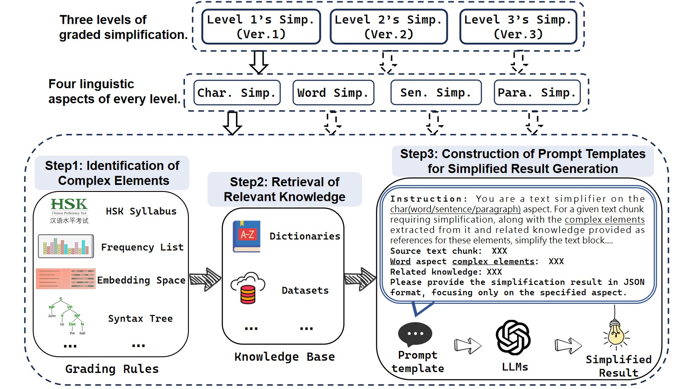

# LLM4DocSimp

LLM-based Document Graded Simplification Approach

## 1. Introduction

Our task focuses on **Chinese Graded Simplification**, combining the two core aspects of **graded reading** and **document simplification**. The goal is to generate Chinese texts at different **reading levels**, making them accessible to a wide range of readers, from beginners to advanced learners. By controlling the complexity of the content through rules and leveraging the power of large language models (LLMs), we aim to provide **customized, level-appropriate texts** for readers with varying linguistic abilities.

The **LLM4DocSimp** framework implements **graded simplification control** across three difficulty levels and four linguistic aspects. Using a **rule-based approach combined with LLMs**, this system generates content tailored to the reading proficiency of different readers, considering their unique cultural backgrounds and reading abilities. This method offers a dynamic, efficient solution for simplifying Chinese texts at scale.

## 2. Structure of Codes

The codebase consists of several key modules, each serving a specific purpose in the overall simplification process. Below is a brief description of the structure:

### Database
This module contains the construction of rule libraries and knowledge bases. It includes the raw materials used for building the databases that drive the simplification process.

### Datasets
Contains the original files used to build datasets and rule libraries. These files provide the foundation for training and testing the system.

### Evaluate
This module includes methods for evaluating the quality of simplifications. It helps assess the performance of the system based on various metrics and simplification criteria.

### JWDS_examples
This folder contains examples from the **JWDS** (Journey to the West Document Simplification) dataset. It showcases how different levels of simplification are applied to a classic Chinese text.

### LLMS
This module handles the integration of large language models (LLMs). It includes the code for invoking LLM APIs, ensuring smooth communication between the simplification framework and the models.

### MDDS_examples
This folder contains examples from the **MDDS** (Multi-Domain Document Simplification) dataset, which tests the framework on diverse document types beyond literary works.

### Methods
Contains the implementation code for **LLM4DocSimp**, including all the logic that drives the simplification process. This is the core module where simplifications are executed based on input parameters.

### Test
This module is designed to test the normal operation of each model and code module, ensuring that everything functions correctly before running larger experiments.

### Utiles
Includes utility functions such as parameter configurations, data preprocessing scripts, and other auxiliary tools that support the overall framework.

## 3. Datasets

The **JWDS** and **MDDS** datasets are crucial to the evaluation of the LLM4DocSimp framework. These datasets contain both simplified and original versions of texts, with different levels of difficulty.

- **JWDS Dataset**: [Link to JWDS Dataset](#)
- **MDDS Dataset**: [Link to MDDS Dataset](#)

## 4. How to Run the Codes

For instructions on how to run the simplification pipeline, please refer to the `pipeline.py` file located in the `Methods` folder.
